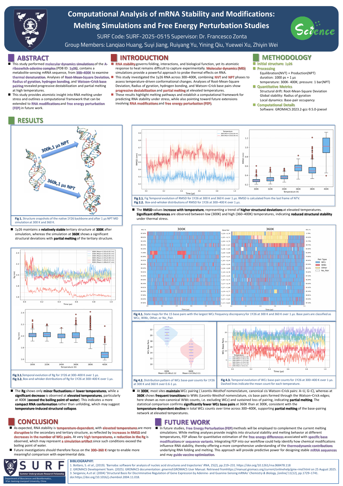

# RNA SURF — Thermal stability of the 1Y26 RNA riboswitch

**XJTLU · School of Science · SURF 2025 · SURF-2025-0515**

This archive follows the weekly development of a molecular-dynamics study of the [1Y26 adenine riboswitch complex](https://www.rcsb.org/structure/1Y26). The project compared RNA structural behavior across 300, 320, 340, 360, 380, and 400 K using RMSD, radius of gyration (Rg), and annotated base-pair states, with a focused 300 K versus 360 K comparison.

**[Final poster](W11/poster/SURF-2025-0515-poster.pdf)**

## Weekly progress

| Week | Work recorded in the original SURF archive | Retained materials here |
|---|---|---|
| W1 | Read background literature on RNA stability and nucleotide modification, and selfstudy on GROMACS, VMD, and HPC; chose 1Y26 and planned the temperature series. | [Selfstudy files for MD simulation](W1/selfstudy/) |
| W2 | Prepared the RNA structure, topology, MD parameter files, and HPC submission scripts. | [Setup files](W2/setup/) |
| W3 | Investigated periodic-boundary artifacts and trajectory centering with `gmx trjconv`. | [Methods to solve PBC problems](W3/pbc/) |
| W4 | Explored RMSD and hydrogen-bond analysis with GROMACS, VMD, and Barnaba. | [RMSD investigation](W4/rmsd) · [H-bonds investigation](W4/hbonds) |
| W5 | Compared initial and final frames and explored PCA. | [PCA](W5/Configurations/) · [Frame comparison](W5/same_first_frame/python_analysis/) |
| W6 | Checked simulation-box behavior and concatenated trajectories for downstream analysis. | [Box check](W6/box) · [Trajectory concatenation](W6/concatenate%20trajectories) |
| W7 | Refined Barnaba pair annotation and frame-level classification; plotted WCc base-pair changes. | [Barnaba](W7/barnaba/) · [Base-pair classification](W7/hbonds/hbonds_python/) · [Base-pair transitions](W7/results_hbonds/) |
| W8 | Prepared structure views and poster analyses for RMSD, Rg, and base-pair behavior. | [Plotting workspace](W8/All_Plots/) · [Structure views](W8/Structure_Plot/) |
| W9 | Explored a 300 K versus 360 K comparison of WCc counts after 0.6 μs. | [Statistical exploration](W9/P_Value/) |
| W10-W11 | Assembled the final SURF research poster. | [Poster and preview](W11/poster/) |

## Reproducibility and scope

The workflow used GROMACS 2023.2, Python with NumPy, pandas, Matplotlib, Seaborn, and SciPy, Barnaba/MDTraj, and PyMOL. See [reproducibility notes](REPRODUCIBILITY.md) for retained inputs, a project-specific Barnaba customization, and the limits of this archive.

## Acknowledgements

This SURF project was supervised by Dr. Francesco Zonta and conducted by the SURF group members listed on the poster; most of the content in this repository was created by Yuewei Xu.
